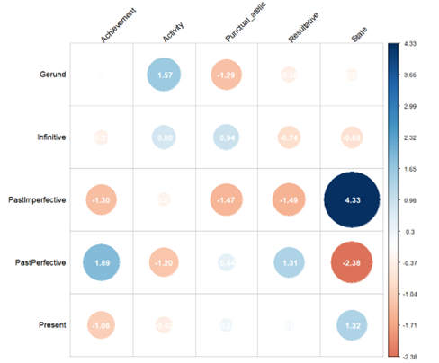
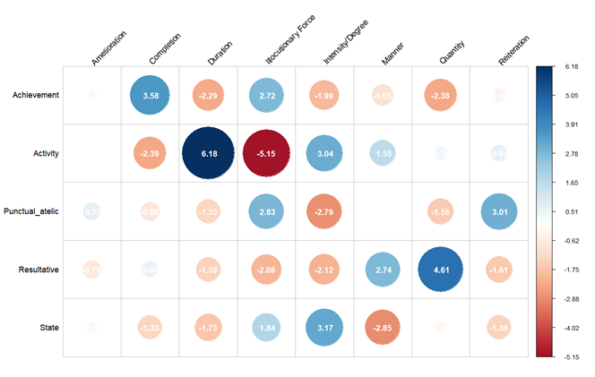
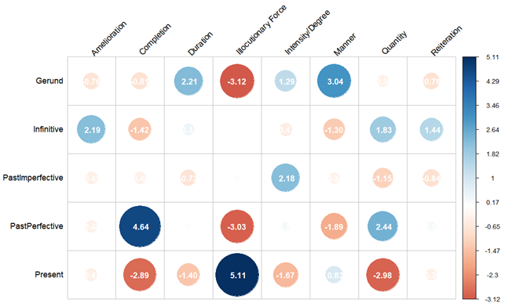
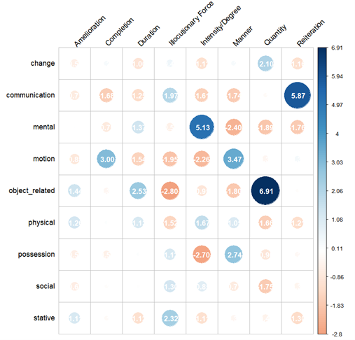

# Verb*issimo*

Repository containing materials and code for the poster "Superlative events: intensifying verbs in Italian through the elative suffix -*issimo*".

## 1. Data distribution and test results

### 1.1. Verbs Found
* Found types: 201/350
* Found tenses: 371/1500

### 1.2. Tenses

|*tense*|Gerund|	Infinitive | PastImperfective |	PastPerfective |	Present|
|-------|------|-------------|------------------|----------------|---------|
|*n. verbs*|44|	67|	14	|121	|125|

### 1.3. Aktionsart

| Class | Not_Found (types) | Found (types)| **Sum**|
|-------|-------------------|--------------|--------|
| Achievement | 39 | 61 | **100** |
| Activity | 28 | 46 | **74** |
| Punctual_atelic | 26 | 27 | **53** |
| Resultative | 34 | 31 | **65** |
| State | 22 | 36 | **58** |
| **Sum** | **149** | **201** | **350** |

#### 1.3.1. Aktionsart vs. Tense

|Tense   | Achievement |	Activity | 	Punctual_atelic |	Resultative |	State |
|--------|-------------|-----------|------------------|-------------|-------|
| Gerund | 13 | 15 | 3 | 5 | 8 |
| Infinitive | 19 | 19 | 11 | 7 | 11 |
| PastImperfective | 2 | 3 | 0 | 0 | 9 |
| PastPerfective | 44 | 25 | 17 | 20 | 15 |
| Present | 33 | 29 | 17 | 17 | 29 |

*Fig. 1) Standardized residuals of the chi-square test (p = 0.01, V = 0.14).*

### 1.4. Semantic Field

| *SemField* | change | communication | mental | motion | object_related | physical | possession | social | stative |
|----------|--------|---------------|--------|--------|----------------|----------|------------|--------|---------|
| *n. verbs* | 26     | 39            | 87     | 56     | 24             | 28       | 27         | 31     | 32      |

### 1.5. Intensification

|*Intensified feature*|Amelioration|Completion|Duration|Illocutionary Force|Intensity/Degree|Manner|Quantity|Reiteration|
|----------|-------|-------|-------|-------|-------|-------|-------|-------|
| *n. tenses*|4|36|12|121|70|62|29|16|

#### 1.5.1. vs. Aktionsart

             |     Amelioration    |     Completion    |     Duration    |     Illocutionary   Force    |     Intensity/Degree    |     Manner    |     Quantity    |     Reiteration    |
|------------------------|---------------------|-------------------|-----------------|------------------------------|-------------------------|---------------|-----------------|--------------------|
|     Achievement        |     1               |     20            |     0           |     47                       |     14                  |     15        |     3           |     4              |
|     Activity           |     1               |     3             |     12          |     10                       |     27                  |     20        |     8           |     5              |
|     Punctual_atelic    |     1               |     3             |     0           |     24                       |     2                   |     8         |     1           |     6              |
|     Resultative        |     0               |     6             |     0           |     10                       |     4                   |     15        |     12          |     0              |
|     State              |     1               |     4             |     0           |     30                       |     23                  |     4         |     5           |     1              |

*Fig.2) Standardized residuals of the chi-square test (p = 0.001, V = 0.34).*

#### 1.5.2. vs. Tense

|                         |     Amelioration    |     Completion    |     Duration    |     Illocutionary   Force    |     Intensity/Degree    |     Manner    |     Quantity    |     Reiteration    |
|-------------------------|---------------------|-------------------|-----------------|------------------------------|-------------------------|---------------|-----------------|--------------------|
|     Gerund              |     0               |     3             |     4           |     6                        |     12                  |     15        |     3           |     1              |
|     Infinitive          |     2               |     2             |     2           |     16                       |     8                   |     5         |     7           |     4              |
|     PastImperfective    |     0               |     1             |     0           |     5                        |     6                   |     2         |     0           |     0              |
|     PastPerfective      |     1               |     25            |     4           |     29                       |     25                  |     15        |     16          |     6              |
|     Present             |     1               |     5             |     2           |     65                       |     19                  |     25        |     3           |     5              |

*Fig.3) Standardized residuals of the chi-square test (p = 0.001 , V = 0.24).*

#### 1.5.3. vs. Semantic Field

|                       |     Amelioration    |     Completion    |     Duration    |     Illocutionary   Force    |     Intensity/Degree    |     Manner    |     Quantity    |     Reiteration    |
|-----------------------|---------------------|-------------------|-----------------|------------------------------|-------------------------|---------------|-----------------|--------------------|
|     change            |     0               |     3             |     0           |     10                       |     3                   |     5         |     5           |     0              |
|     communication     |     0               |     1             |     0           |     19                       |     4                   |     3         |     3           |     9              |
|     mental            |     1               |     7             |     5           |     28                       |     34                  |     8         |     3           |     1              |
|     motion            |     0               |     12            |     0           |     13                       |     5                   |     19        |     4           |     3              |
|     object_related    |     1               |     2             |     3           |     2                        |     3                   |     1         |     11          |     1              |
|     physical          |     1               |     3             |     2           |     6                        |     9                   |     7         |     0           |     0              |
|     possession        |     0               |     2             |     1           |     12                       |     0                   |     10        |     1           |     1              |
|     social            |     0               |     3             |     1           |     14                       |     8                   |     4         |     0           |     1              |
|     stative           |     1               |     3             |     0           |     17                       |     4                   |     5         |     2           |     0              |

*Fig.4 Standardized residuals of the chi-square test (p = 0.001 , V = 0.27).*

## References

* Audring, J., Leufkens, S., & Van Lier, E. (2021). Small events. Verbal diminutives in the languages of the world. *Linguistic Typology at the Crossroads*,1(1), 223–256. https://doi.org/10.6092/issn.2785-0943/13427
* Cacchiani, S. (2011). Intensifying affixes across Italian and English. *Poznań Studies in Contemporary Linguistics*, 47(4), 758–794. https://doi.org/10.2478/psicl-2011-0038
* De Mauro, T. (2003). *Guida all’uso delle parole: parlare e scrivere semplice e preciso per capire e farsi capire*. Editori Laterza.
* Fleischhauer, J. (2016). *Degree Gradation of Verbs*. Düsseldorf University Press.
* Gaeta, L. (2011). Superlativo. In R. Simone (Ed.), *Enciclopedia dell’italiano. Istituto della Enciclopedia italiana Giovanni Treccani*. https://www.treccani.it/enciclopedia/superlativo_(Enciclopedia-dell'Italiano)/
* Grandi, N. (2002). *Morfologie in contatto: le costruzioni valutative nelle lingue del Mediterraneo*. FrancoAngeli.
* Grandi, N. (2008). *I verbi deverbali suffissati in italiano: dai dizionari ai web*. Caissa Editore.
* Grandi, N. & Iacobini, C. (2008). L’affissazione valutativa nei verbi dell’italiano. In E. Cresti (ed.), *Nuove prospettive nello studio del lessico. Atti del IX Congresso Internazionale SILFI (Firenze, 15-17 giugno 2006)*, (pp. 483–490). Firenze University Press.
* Merlini Barbaresi, L. (2004). Aggettivi deaggettivali. In M. Grossmann & F. Rainer (Eds.), *La formazione delle parole in italiano* (pp. 444–449). Niemeyer.
* Napoli, M. (2013). On Italian past participles with -issimo: The superlative of events between intensification and pluractionality. *Linguistica e Filologia*, 33, 85–126.
* Napoli, M. & Ravetto, M. (2017). Ways to intensify: Types of intensified meanings in Italian and German. In M. Napoli & M. Ravetto (Eds.), *Exploring Intensification: Synchronic, diachronic and cross-linguistic perspectives* (pp. 327–352). John Benjamins Publishing Company. https://doi.org/10.1075/slcs.189.17nap
* Portero Muñoz, M. C. (1997). Syntactically relevant semantic features. *Alfinge. Revista de Filología*, 9, 333–354. https://doi.org/10.21071/arf.v9i.7173
* Voghera, M., Iacobini, C., Savy, R., Cutugno, F., De Rosa, A., & Alfano, I. (2014). VoLIP: a searchable Italian spoken corpus. In L. Veselovská & M. Janebová (Eds.), *Complex Visibles Out There. Proceedings of the Olomouc Linguistics Colloquium: Language Use and Linguistic Structure* (pp. 628–640). Palacký University.
